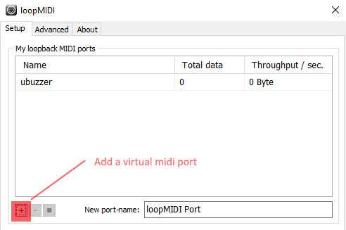

# buzzer:42005
## Play old DOS game music or build alarm with a piezo buzzer

# Overview
Piezo Buzzers makes loud and unpleasant noise, it is mostly used in 
alarms clock, fire alarm, cooking plate.    
But Piezo buzzers can also play **tones** ! and was widely used on old PC
to generate music in games in spite of any alternative.

  

# Circuit

I used the [toneAC](https://bitbucket.org/teckel12/arduino-toneac/wiki/Home) library for arduino, instead of the standard one.   
With this library you can set the volume, and the "quality" is better but you will need **2 specific pins** instead of **1**.    

## Bill of Materials
Here is what I bought to build this module, I buy components in bulk to
reduce cost.

* Compatible Arduino nano (robotdyn nano v3): 2€    
* 10 Buzzer : 1.80€  (1 Buzzer:0.18€)  
* Resistor pack 400pcs (3€) (1 resistor: 0.0071€) 
* 5 pcs stripboard (1.18€) (1 stripboard : 0.24€ )  
* Total : 7.98€ (2.43€)   

> **Don't forget to isolate the circuit from the arduino with electrical tape**

## Buzzer
   
* Pin 9 --> RESISTOR (100Ω) --> Buzzer +   
* Pin 10 --> Buzzer -    

## Buzzer/Led
   
You can add a led (**before the resistor**), it will light up when the buzzer
is used.
* Pin 9 --> RESISTOR (100Ω) --> Led + --> Buzzer +   
* Pin 10 --> Led - --> Buzzer -  

# Commands
Using the serial monitor on Arduino, you can test this module.    
**Settings: No line ending / 115200**

* /info --------> show buzzer:42005
* X -------> Play tone where X is the frequency in hz
* OFF -------> Stop sound    

Here is a list of notes and their frequency in hz

```
	 C        C#       D	    Eb	   E	    F	    F#	   G	    G#	   A	    Bb	   B
0	16.35	17.32	18.35	19.45	20.60	21.83	23.12	24.50	25.96	27.50	29.14	30.87
1	32.70	34.65	36.71	38.89	41.20	43.65	46.25	49.00	51.91	55.00	58.27	61.74
2	65.41	69.30	73.42	77.78	82.41	87.31	92.50	98.00	103.8	110.0	116.5	123.5
3	130.8	138.6	146.8	155.6	164.8	174.6	185.0	196.0	207.7	220.0	233.1	246.9
4	261.6	277.2	293.7	311.1	329.6	349.2	370.0	392.0	415.3	440.0	466.2	493.9
5	523.3	554.4	587.3	622.3	659.3	698.5	740.0	784.0	830.6	880.0	932.3	987.8
6	1047	 1109	 1175	 1245	 1319	 1397	 1480	 1568	 1661	 1760	 1865	 1976
7	2093	 2217	 2349	 2489	 2637	 2794	 2960	 3136	 3322	 3520	 3729	 3951
8	4186	 4435	 4699	 4978	 5274	 5588	 5920	 6272	 6645	 7040	 7459	 7902
```
Source: [seventhstring](https://www.seventhstring.com/resources/notefrequencies.html)

# 3D Printing
This model is a **all purpose case** for arduino nano projects     
> * This model can be a little too small to fit the circuit    
> * You can boost the volume of the buzzer by drilling a hole thought the case.    

   
Models by Olivier Sarrailh : [https://github.com/madnerdorg/buzzer/tree/master/3D]()    

# Applications

## Play Music with your speaker
We are going to control our buzzer using a USB midi keyboard.    

You will need the following software:
* LibreConnect
* Chrome web browser
* LoopMidi
* LMMS / Music Software

> As of today HTML5 Midi is not supported by firefox, you will need **Chrome/Chromium**

### Compose music
    
Examples are available in **lmms/** 
* Download **LMMS** : https://lmms.io/download/#windows
* On **TripleOscillator** put the volume to 0
* Click on the gear next to **TripleOscillator**
* Click on Midi and choose your **virtual midi port** (**Loopmidi by default**) ## 

### Midi Keyboard
* Plug your **MIDI keyboard**.
* Go to [http://madnerd.org/interface/midi](http://madnerd.org/interface/midi)


### LoopMidi 
     
We are going to use loopMidi to generate virtual midi port on Windows.
* Download : [loopMidi](http://www.tobias-erichsen.de/software/loopmidi.html)
* Click on **+** to create a virtual midi port

### LMMS


# Licences
## Buzzer.ino
* Author: Rémi Sarrailh (madnerd.org)   
* Licence: MIT

## ToneAC
* Author: Tim Eckel
* Licence : GNU GPL v3
* Link: [https://bitbucket.org/teckel12/arduino-toneac/wiki/Home]()
* Donate : [PayPal](https://bitbucket.org/teckel12/arduino-toneac/wiki/Home#!show-your-appreciation)
